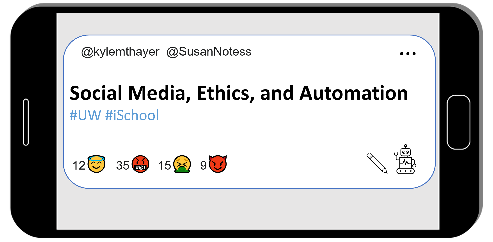

# Social Media, Ethics, and Automation



Automation drives our experience of social media platforms, from timeline feeds to disinformation bots. This book examines social media phenomena, like viral memes, parasocial relationships, and harassment campaigns. This book then explores the ethics of automation on social media platforms by experimenting with computer programs that automate social media actions. We assume no prior programming experience.

This book is about:
- Social Media
  - What it does, how it works, how people use it, different uses and abuses, etc.
- Ethics
  - Individual behaviors, group behaviors, design and management decisions, etc.
- Automation
  - basic programming skills in Python, create social media bots, get information from social media platforms, etc.

We hope after completing this book you will be informed and engaged as social media user, as a member of a society where social media plays a large role, and potentially as a worker in a social media company.

```{warning}
This book is still being created and therefore has incomplete sections, missing citations, etc.
```


````{admonition} Full Table of Contents
:class: dropdown
```{tableofcontents}
```
````
